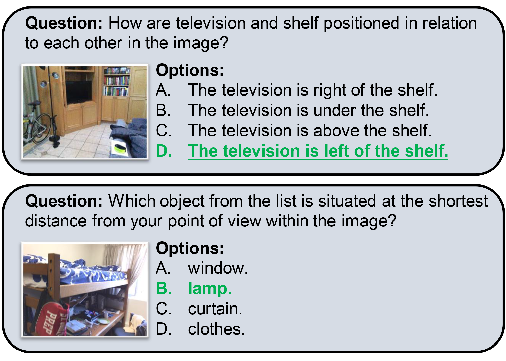
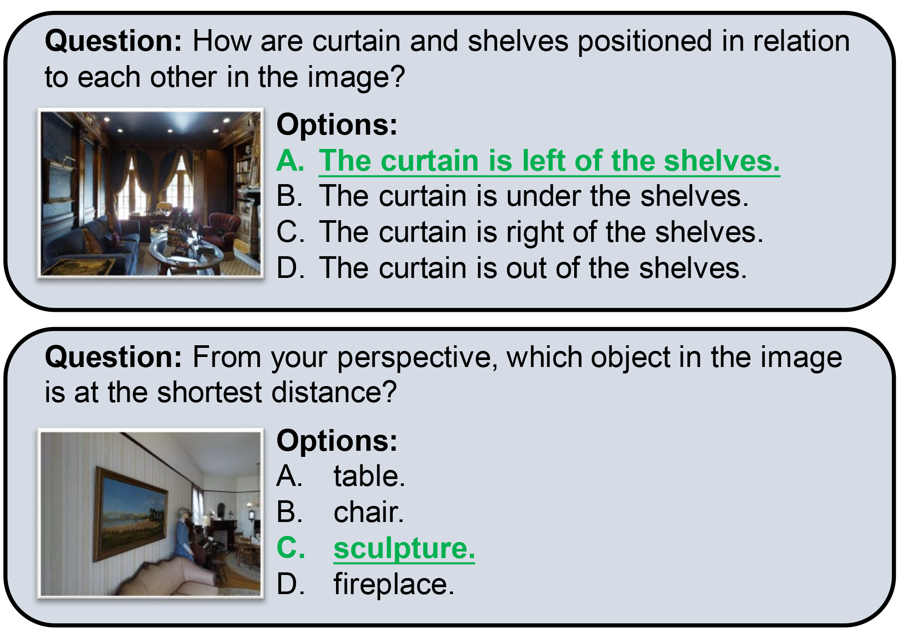
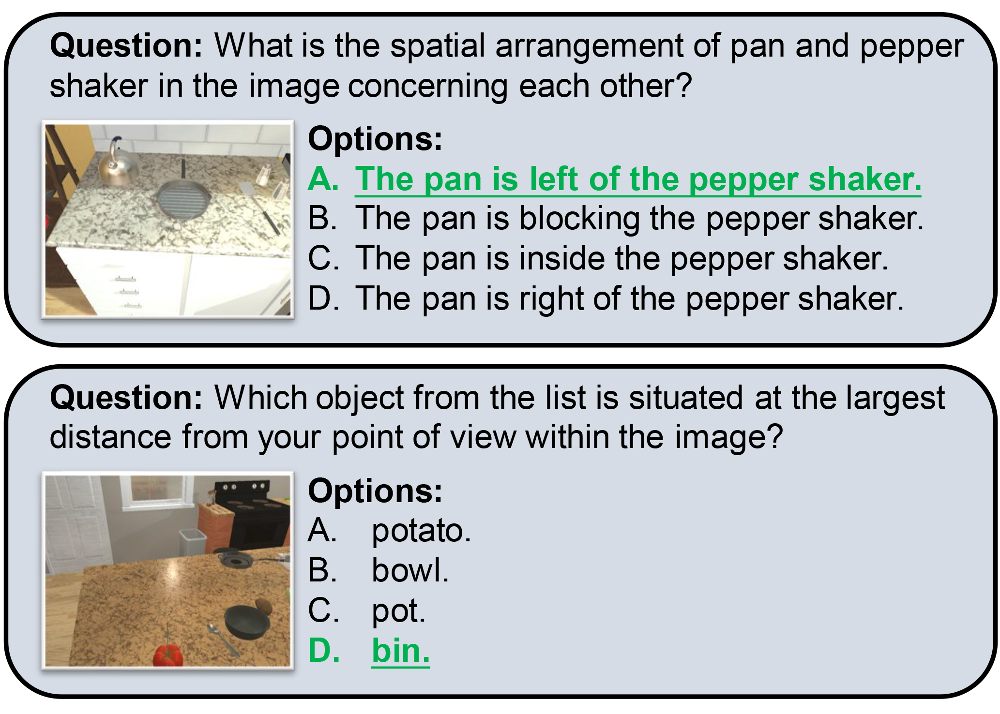
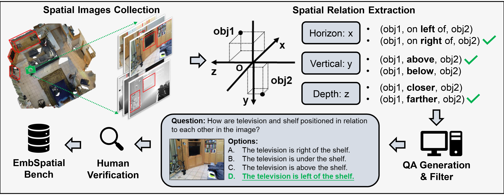

# EmbSpatial-Bench

<h2>🎇EmbSpatial-Bench: Benchmarking Spatial Understanding for Embodied Tasks with Large Vision-Language Models
</h2>

    Mengfei Du†;
    Binhao Wu†</a>;
    Jiwen Zhang;
    Zhihao Fan;
    Zejun Li;
    Xuanjing Huang;
    <a href='http://www.sdspeople.fudan.edu.cn/zywei/' target='_blank'>Zhongyu Wei*</a>

†equal contribution; *corresponding author.

 

## 🍹 Overview
The recent rapid development of Large Vision-Language Models (LVLMs) has indicated their potential for embodied tasks. However, the critical skill of spatial understanding in embodied environments has not been thoroughly evaluated, leaving the gap between current LVLMs and qualified embodied intelligence unknown. Therefore, we construct EmbSpatial-Bench, a benchmark for evaluating embodied spatial understanding of LVLMs. The benchmark is automatically derived from embodied scenes and covers 6 spatial relationships from an egocentric perspective. Below are a few examples.

  

## 🍸 Dataset Construction

## 🍻 Concat

If you are interested in accessing this dataset or have any related questions, please don't hesitate to reach out to us at mfdu22@m.fudan.edu.cn.

